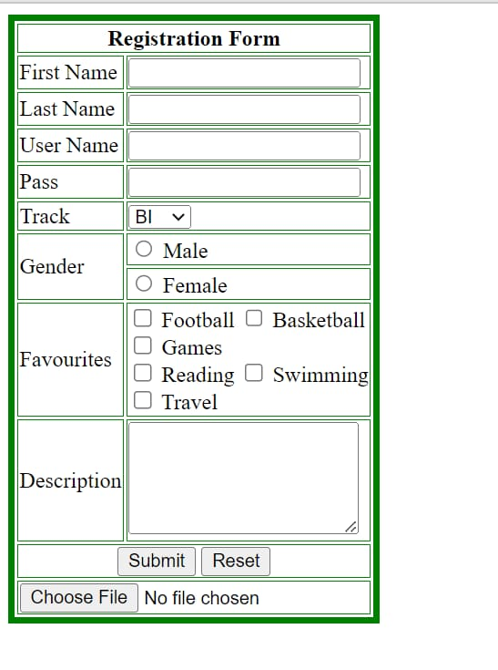

### Form

A task for ITI on day 2 of the HTML/ CSS course to create a form with HTML as shown in the requirements. Try the [form](https://aya-hegab.github.io/form-html_css-day2_task1-iti/) now.

## Requirements

Task1

